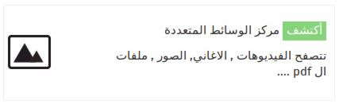
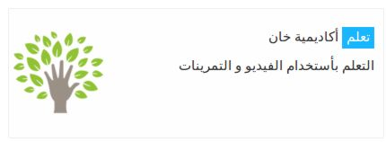
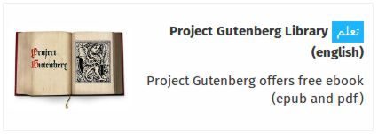

. هو القسم من الواجهة الرسوميه التي من الممكن الوصول اليها من قبل الجميع

## المدونة

المدونة تسمح لك بنشرمقالات يمكن مشاهدتها من جميع مستخدمين الideasbox . و يمكنك أيضا دعم هذا المقال عن طريق أستخدام ملفات الوسائط الموجوده على مركز الوسائط أو اضافه الوسائط التي تريدها .

## مركز الوسائط المتعددة

مركز الوسائط يجمع معا جميع الانواع من ملفات الوسائط :

الصور

الفيديو

ملفات ال PDF

ملفات ال Epubs

ملفات الموسيقى \( الصوتية \)

ملفات النصية

التطبيقات الالكترونية

و جميع هذه الملفات يمكن أضافة الوسوم لها حتى تتمكن من إيجادها بسرعه و فعالية

و يمكنك أيضا من استخدام المرشحات للبحث عن نوع واحد فقط مثلا عرض الصور فقط , أو الفيديو .

## المكتبة

يشمل ال ideascube تطبيق إدارة الكتاب , حيث يسمح لك بتصفح جميع الكتب المتاحه لك في ال ideasbox  بنوعيها الكتب الالكترونية و الكتب الورقية . و يمكنك القيام بالبحث عن الكتب الموجودة من خلال عنوان الكتاب , او المؤلف .

كما يمكنك أيضا تصنيف الكتب حسب العنوان , تاريخ التعديل \( أضافة الكتاب الى المكتبة \) , المؤلف أو حسب اللغة .

## التطبيقات

وفقا لحاجيات المشروع , يتم تثبيت التطبيقات المختلفة و فيما يلي بعض الأمثلة على ذلك

تتيح لك التعلم بأستخدام مجموعه واسعه من 
الفيديوهات و التمرينات .

  تتيح لك الحصول على مجموعه واسعه من الكتب الالكترونية المجانية .

تتيح لك قراءة المعلومات و التعديل عليها .

تتيح لك متابعة فيديوهات لمناظرات تعليمية و تثقيفية .

