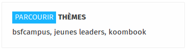
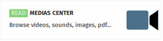
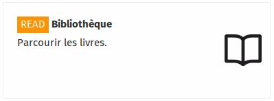
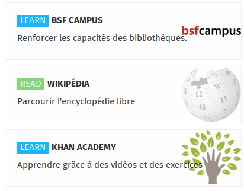

The user section of the interface can be accessed by everybody.

## Blog

_The blog allows you to post messages that can be viewed by all users of the KoomBook. You can also illustrate your messages using media files found in the Media Center._

_These themes are used to group together messages according to listed keywords._

## Media Center

The Media Center groups together all types of media files:

* Images
* Videos
* PDF files
* Audio files
* Text files
* E-books
* IT applications

Content can be tagged so it can be found quickly.

You can also filter by file type, in order to display only images or videos, for example.

## The Library

IdeasCube includes a book administration application. _Please note, this application is not available on KoomBooks, as they do not generally include paper books._

The Library application allows you to browse all the books available in the Ideas Box, whether in print or digital.

The Library is used to manage all the books in the Ideas Box.  It allows users to browse the collection of books, search by title or author, and sort books by title, date added, author and language. 

## Applications

Depending on the project, various applications are installed. Here are a few examples:

- **BSF Campus**: Building program for librarians
- **Wikipedia**: Collective, universal, multilingual encyclopedia, using the wiki principle 
- **Khan Academy**: Free set of more than 2200 video mini-lessons on a variety of themes with a focus on mathematics

