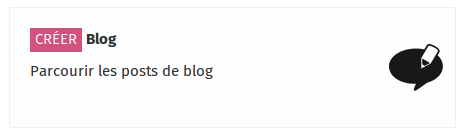
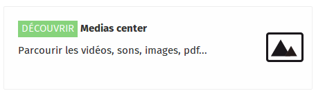

La partie utilisateur est l'interface accessible à tous, on retrouve un blog, le media-center, des paquets de contenus, etc.

## Le Blog

_Le blog vous permet de poster des messages visibles par tous les utilisateurs du KoomBook. Vous avez la possibilité également d'illustrer vos messages grâce aux médias présent dans le média-center_

## Le Media center

Le média-center regroupe tous les types de médias

* Image
* Vidéo
* Pdf
* Son 
* Texte
* Epub  
* Application informatique

Ces contenus peuvent être associés à des tags afin d'être retrouvés rapidement.

Vous pouvez également utiliser des filtres par type de fichier, pour par exemple ne voir que les images ou que les vidéos.

## La bibliothèque

Ideascube intègre une application de gestion de livres. _Attention, cette application n'est pas présente sur les KoomBooks, ceux-ci n'intégrant pas systématiquement des livres physiques._

L'application bibliothèque vous permet de parcourir l'ensemble des livres disponibles dans l'ideas box, que ce soit des livres physiques ou des livres numériques.

La bibliothèque permet de gérer l'ensemble des livres de l'ideas box, papiers ou numériques. Elle permet aux utilisateurs de parcourir la collection de livres, d'effectuer une recherche sur un titre ou un auteur, de classer les livres par titre, date d'ajout, auteur et par langue.

## Les contenus pré-chargés

Suivant les projets différentes applications et contenus sont installées, on peut par exemple retrouver

* La [Khan Academy](http://khanacademy.demo.ideascube.org/) en version offline
* [Wikipedia](http://kiwix.demo.ideascube.org/wikipedia.es/) et plus généralement tous les sites édités par la fondation [wikimedia](https://www.wikimedia.fr/)
* Des [sites static](http://sites.demo.ideascube.org/icarito.es/)
* Mais aussi [des paquets de contenus](http://demo.ideascube.org/fr/mediacenter/?source=bien-etre-et-communication-au-travail-fr) sélectionnés par BSF

