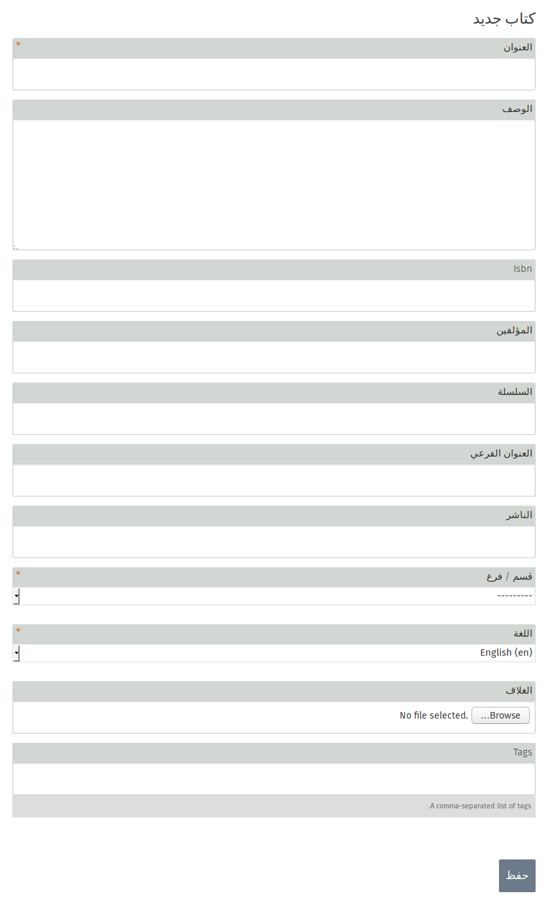
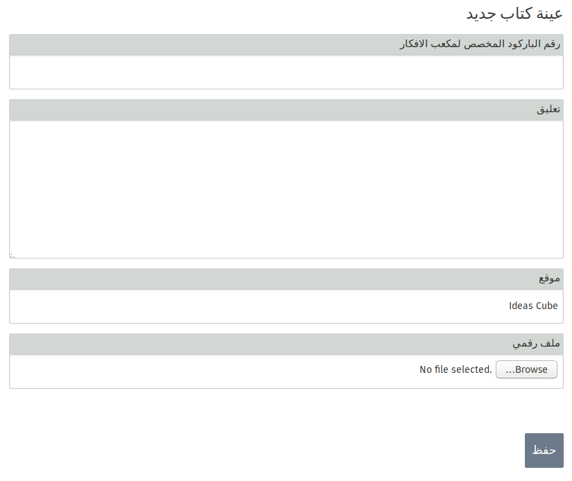

الإداريين وحدهم بأمكانهم انشاء , تعديل , أو حذف الكتب , كما يمكنهم أيضا أضافه عينات \(نسخ\) من الكتب التي تم أنشائها

## الكتب و النسخ

من أجل أستخدام تطبيق المكتبة , يجب عليك أولا ان تميز الفرق بين الكتاب و بين العينة \(النسخ\) الخاصه به .

الكتاب هو المفهوم العام للكتاب\( المعلومات \) , أما العينة فهو الكتاب الفعلي \(الكائن الملموس\)

و من الممكن أن يكون للكتاب الواحد أكثر من عينة . و في حال لم يتم أنشاء عينات للكتاب فإن الكتاب لن يكون متوفرا في قائمه الكتب الموجوده في المكتبة \( التي يمكن للمستخدم أستعمالها \).

## إضافة كتاب :

يجب عليك أضافة الكتاب قبل أن تتمكن من أضافة عينه خاصه به \(نسخه\) , و للقيام بذلك يجب عليك من خلال تطبيق المكتبه أن تضغط على خيار **إضافة كتاب**

ملاحظة : لن تتمكن من رؤيه خيار إضافه كتاب في حال لم تسجل دخولك كأحد المسؤولين

و بذلك يكون الكتاب هو الوصف بما فيه العنوان , المؤلف , رقم ال ISBN , صورة الغلاف , السلسلة , الوصف , العنوان الفرعي , دار النشر , القسم \( الفئه : الكبار , الأطفال , المسرح , الرواية ... وما الى ذلك \) , اللغه , و الوسوم \(Tags \) .

## أضافة العينات \( النسخ \)

بعد أضافة الكتاب لا بد لنا من أضافه النسخ من الممكن أن تكون نسخه واحده أو أكثر و للقيام بذلك يجب عليك أن تختار الكتاب الذي تريد أضافة النسخ اليه و من ثم أضغط على خيار " **أضافة عينة " .**

ملاحظة : لن تتمكن من رؤيه خيار إضافه كتاب في حال لم تسجل دخولك كأحد المسؤولين.

يتم أعطاء العينه \( النسخه \) الباركود الخاص بال IdeasBox , تعليق \( وهو لبيان حاله العينه أو اي معلومه مفيده عن الكتاب \) , موقع في حال الكتاب نسخه ورقية , أو ملف في حال كان كتاب ألكتروني .

## إستيراد الكتب

يمكنك إستيراد مجموعه من الكتب مرة واحده من خلال خيار **إستيراد - حفظ الخصائص** . من هذا الخيار يمكنك إستيراد أربعة أنواع من الملفات

1- ملفات من ideasbox أخر بنفس صيغه ال ideascube

2- ملفات تعتمد على  استعمال رقم ال ISBN للكتاب

3- ملف csv من موقع [Moccam en ligne](http://www.moccam-en-ligne.fr/) و هو موقع متخصص بإعطائك مجموعه من الكتب التي من الممكن اضافتها الى المكتبة

4- ملفات بصيغه رقميه

دائما يفضل عند استعمال الخياران الأولان ان يكون الاستيراد بنفس صيغه ال ideascube  أو باستعمال رقم ال ISBN للكتاب .

**لإستيراد ملف بنفس صيغه ال ideascube : **

قبل عمليه الاستيراد يجب عليك تحديد الطريقة التي سوف تتبعها من لائحه الخيارات , في هذه الحاله عليك إختيار "**Ideascube ZIP"  **ثم تقوم بالضغط على زر **Browse**  لتصفح الملفات و أضافه الملف , ثم تقوم بالضغط على زر **"تحميل الخصائص من داخل الملف " **, إن هذا الخيار مفيد فقط في حاله اردت استيراد الملف بصيغه ideascube من ideascube  أخر .

لحصول على ملف ideascube من  ideascube أخر , فإن العمليه تكون من خلال أختيارك **" تصدير الخصائص "** حيث سوف تحصل على ملف يحتوي على جميع الكتب بصيغه ideascube .

**لإستيراد ملف بأستخدام رقم ال ISBN للكتاب :**

في هذه الحالة سوف تقوم على أستخدام رقم الISBN للحصول على جميع خصائص الكتاب و أضافتها الى المكتبة , إن هذا الخيار يعمل فقط في حال كان ال ideasbox server متصل بشبكة الأنترنت , حيث أن جميع الخصائص سوف يتم أستيرادها من الموقع الألكتروني [http://openlibrary.org/](http://openlibrary.org/) . و يضفل قبل عمليه الاستيراد أن تتطلع على الخصائص التي سيتم تزويدك بها .

**لإستيراد الخصائص بأستخدام ملف SCV : **

يتيح لك ذلك الخيار من استيراد خصائص الكتب التي قمت أنت بانشائها بصيغه ملف  SCV , في هذه الحاله من الشاشه السابقه يمكنك اختيار **" إستيراد الخصائص " **مم يتيح لك الضغط على زر **Browse** الذي يمكنك من تصفح جهازك الحاسوب و اختيار الملف المراد استيراده .

ملاحظة مهمة : إن عمليه أتسراد الخصائص هي فقط عمليه لأضافه خصائص الكتب \( المعلومات \) الى المكتبه , و إن هذه الكتب لن تكون متاحه للمستخدمين الى في حال تم إنشاء عينات لها \( نسخ \) تحمل رقم الباركود المخصص لها , و في هذه الحاله سوف تتمكن من أعاره هذه الكتب للمستخدمين .

## إعارة الكتب

بعد قيامك بأنشاء الكتاب و أضافة العينات \(النسخ \) المضاف لها الباركود الخاص بها , يمكنك الأن من أعاره الكتب من خلال الضغط على تطبيق  **" الأستعاره "** من الشاشه الرئيسية

حيث عند إعارتك لكتاب يجب عليك ادخال المعلومات الخاصة بالكتاب \( رقم الباركود , أسم المستخدم الذي ستتم أعارته الكتاب , التاريخ , التعليقات \)

و عند ارجاع هذا الكتاب تقوم بأدخال رقم العينه في خانه العوده و الضغط على زر **حفظ**

كما يمكنك إستيراد جميع عمليات الأعاره التي قمت بها من خلال تحديد التاريخ الذي تريده و الضغط على زر **استيراد**

و كما يمكنك أيضا من رؤيه جميع عمليات الأستعاره التي قمت بها من خلال لائحه الاستعارات الحالية الظاهرة في أسفل الشاشة .

