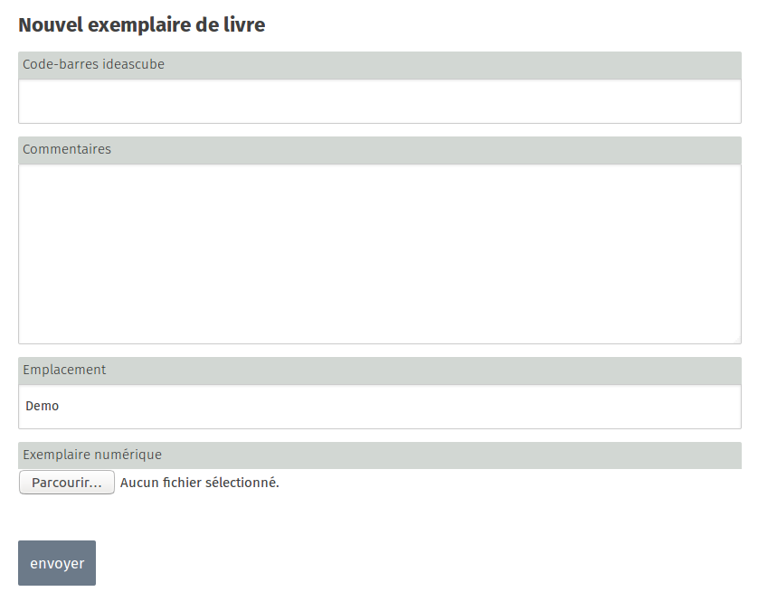

Administrators can add, modify and remove books in the library, and add copies for each of the books.

## Books and Copies

To use the Library application, you need to know the difference between a book and a copy. The book is a concept, while the copy is the physical object of the book. A book can be associated with one or more copies. It is possible to have more than one copy of a book in a library. If no copy has been created for a book, the book will not appear in the library.

## Creating books

You must create a book before creating a copy. To do this in the Library application, click on the **Create a book** button.  _Note: this button only appears if you are signed in as an Administrator._

You are creating a description of a book, including the title, author, ISBN number, cover picture, series, summary, sub-title, publishing house, a category (adult, children, theatre, novel, etc.), a language and tags.

## Creating copies

Once the book is created, you can assign one or more copies to it. To do so, click on the book, and click on the button **Add a copy**. _Note: this button only appears if you are signed in as an Administrator._

A copy is given a barcode, comments (to state the condition of the book copy or any other useful information), a location (if it is a paper book), or a file to be uploaded (if it is a digital book).

## Book Loans

By creating a copy and entering the barcode related to a book, you can manage book loans in the Prêt (Loan) application.

## Importing Books

You can import several books at once in the Library via the **import catalogue** option. You can import four types of catalogue files:

- a catalogue from another Ideas Box or KoomBook in Ideascube format 
- books with ISBN numbers
- csv files from [Moccam en ligne](http://www.moccam-en-ligne.fr/)
- a catalogue in unimarc format

>>>>>>We recommend the first two options: importing from a catalogue in Ideascube format or importing using ISBN numbers.

To import from a catalogue in Ideascube format: select the option **"zip ideascube"**, click on "browse" to select the zip file, then click on "Charger des notices depuis un fichier" (Load catalogue from a file). This option is only useful if you wish to import a catalogue from another Ideascube software. In order to do this, you will have had to have already exported the files from another Ideascube. This is done via the option "export a catalogue". The export is in zip file format.

To import books using their ISBN number: enter the files in the fields of the **"From ISBN" form**. This option only works when connected to the internet, as data is recovered from the [openlibrary](http://openlibrary.org/) website. We strongly recommend that Ideascube users enter the information on books which are not directly available on [openlibrary](http://openlibrary.org/) and then restart the import. This way, these will be available to the entire Ideascube and openlibrary.org communities. 

The import creates books. For each book created, you must then create a copy and enter the barcode related to the book.