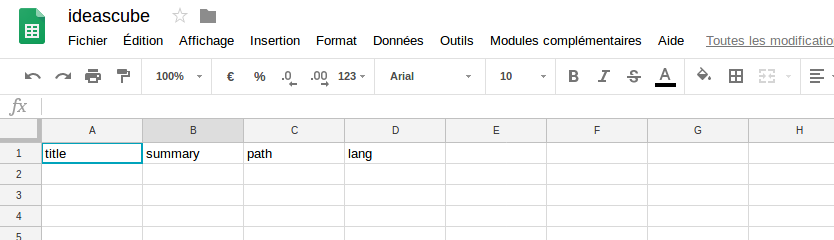
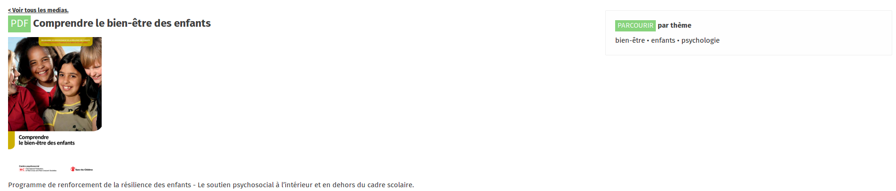
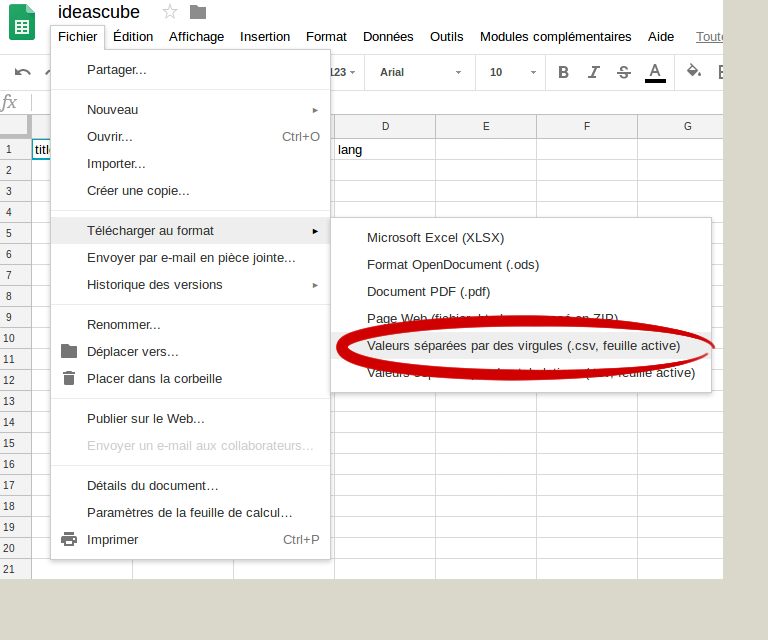

_This option requires you to know how to use Linux._

This option lets you mass import files to the Ideascube Media Center.  It is automated, and doesn't have a size limit.  However, it is inflexible and can be subject to errors.  Thus, it is necessary to copy your content to the machine running Ideascube.

## Creating a CSV File

You can create a CSV file with a Google spreadsheet, [such as this one](https://docs.google.com/spreadsheets/d/1G9DqmYVnWkHVZBjcT-OjIRyAffx2sWSekoPf6uGYUPk/edit#gid=0).  Google Sheets lets you select what content you want to upload, and export it in CSV format.



This file contains four columns:

1. **title**: Must be a short title
2. **summary**: Description that will be visible when you see the document
3. **path**: the name of the selected content, with its extension \(.jpg, .avi, etc.\)
4. **lang**: language of the content **in only two letters**.  Ex: fr, en, es, ar...

You can add a fifth column **tags** if you would like to specify the theme of the document.  With this column you can group together similar documents.

The example below illustrates how a document is presented in the Media Center.



**You must add a new line for each document, but there is no limit to the number of documents you can add**

## Exporting as a CSV File

Once your file is complete, export it as a csv file.  Rename the file **import.csv** without no spaces. 



## Retrieve the Content

1. Create a folder called `media` 
2. Copy all the files you want to import to the `media` folder 
3. Copy your file `imports.csv` to the `media` folder 

At this point, you should have this tree:

```
| media
	|_ photo.jpg
	|_ movie.avi
	|_ imports.csv
```

## Transferring the Files and Starting the Import

Now, it is time to transfer the documents to the machine running Ideascube.  Generally, software like SCP (for Windows: [WinSCP](https://winscp.net/eng/download.php)) will do the job very well.

1. With the help of WinSCP, transfer the `media` folder to the folder `/home/ideascube/` on the machine running Ideascube.
2. With the help of SSH, connect to the machine running Ideascube and use the following command:

```
ideascube@kb-cod-rfi-385 ~ $ ideascube import_medias /home/ideascube/medias/imports.csv
```

**ATTENTION**

* Be sure to run this command with the user `ideascube`.  Click `su ideascube` to look under the user `ideascube`.  Notice the `ideascube@` prompt.  
* Once you've finished the impot, you can delete the transferred `media` folder.
* You can also connect an external drive/thumb drive to your machine and import by directly searching for the contents in the external drive, usually found in `/media/`.  If the external drive doesn't show up automatically, issue the command `sudo mount /dev/sda1 /media`


