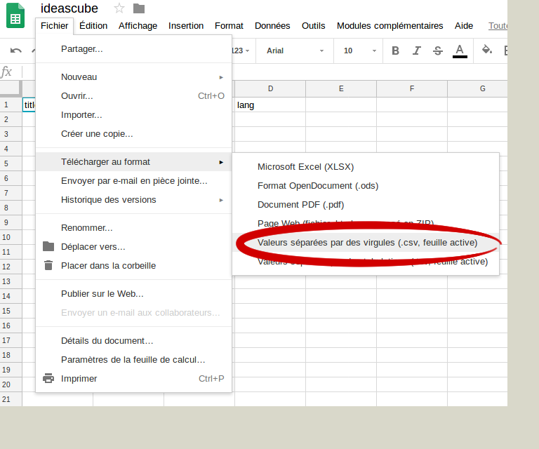

_Cette méthode requiert des compétences dans l'administration d'un système d'exploitation Linux._

La méthode par fichier CSV vous permet d'importer en masse des fichiers dans le media-center d'Ideascube, elle est automatisé, ne comporte pas de limite de taille pour l'import mais a l'inconvénient d'être très peu flexible et sujet à beaucoup d'erreurs, il faut par ailleurs que vous copiez l'ensemble de votre contenu sur la machine faisant fonctionner Ideascube

## Création du fichier CSV

[Un fichier CSV est disponible sur un Google Spreadsheet partagé](https://docs.google.com/spreadsheets/d/1G9DqmYVnWkHVZBjcT-OjIRyAffx2sWSekoPf6uGYUPk/edit#gid=0), il vous permettra de réaliser votre séléction de contenu et de télécharger le fichier au format CSV.


Ce fichier contient 4 colonnes :

1. **title **doit être un titre court de quelques caractères
2. **summary **est la description visible lorsque l'on consulte le document
3. **path **est le nom du fichier choisie avec son extension \(.jpg, .avi, etc.\)
4. **lang** est la langue dans laquelle le media est réalisé, **sur 2 lettres uniquement, ec : fr , en, es, ar...**

Vous pouvez ajouter une 5eme colonne optionnelle **tags** pour spécifier la thématique du fichier, vous pouvez ainsi lier plusieurs fichiers à la même thématique

L'exemple ci-dessous illustre un média présenté dans le media-center


**Il faut donc ajouter une ligne par fichier, il n'y a pas de limite de ligne**

## Export du fichier CSV

Une fois que votre fichier csv est complet, exportez le au format csv, veillez à renommer le fichier en **import.csv **sans espace



## Rassembler les fichiers

1. Créez un dossier `medias` 
2. Copiez tous les fichiers à importer dans le dossier `medias`
3. Copiez votre fichier `imports.csv`dans le dossier `medias`

A ce stade vous devriez avoir cette arborescence

```
| medias
|_ photo.jpg
|_ movie.avi
|_ imports.csv
```

## Transférez les fichiers et lancer l'import

Il faut maintenant transférer les fichiers sur la machine exécutant Ideascube. Généralement cela se fait avec un utilitaire tel que SCP, sous windows [WinSCP](https://winscp.net/eng/download.php) fera très bien le travail

1. A l'aide de WinSCP, transférez le dossier `medias` dans le dossier`/home/ideascube/` de votre machine exécutant Ideascube
2. Connectez vous à l'aide de SSH à votre machine exécutant Ideascube et lancer la commande suivante 

```
ideascube@kb-cod-rfi-385 ~ $ ideascube import_medias /home/ideascube/medias/imports.csv
```

**ATTENTION**

* Veillez impérativement à lancer cette commande avec l'utilisateur `ideascube`. Tappez `su ideascube` pour passer sous l'utilisateur `ideascube`, remarquez le prompt  `ideascube@`
* Une fois l'import réalisé, vous pouvez supprimer le dossier `medias` transféré.
* Vous pouvez également connecter un disque externe / clé USB à votre machine exécutant Ideascube et procéder à l'import en allant chercher directement le contenu dans le disque externe généralement monté dans `/media/...`.
Si le montage de votre de votre disque externe n'est pas automatique, lancez la commande `sudo mount /dev/sda1 /media`


