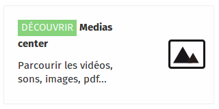
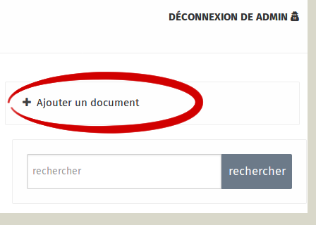
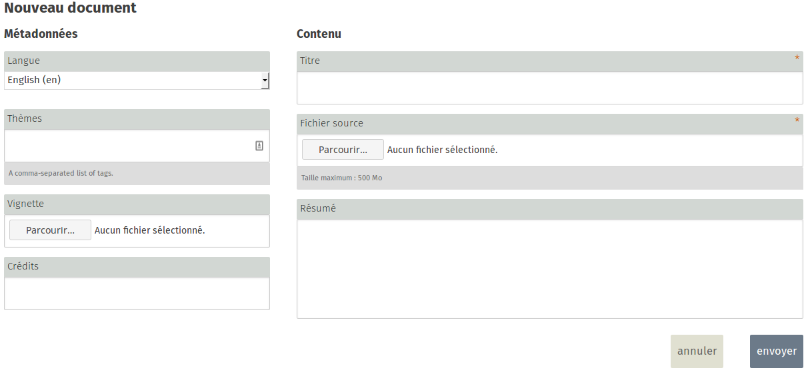
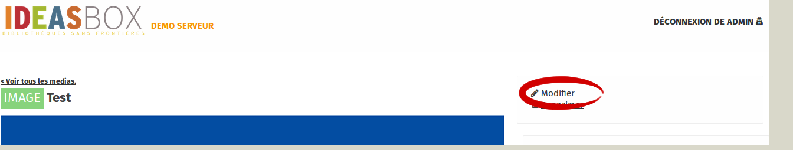
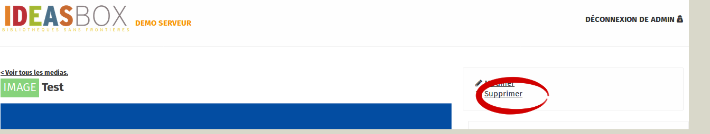

With this option, you have to import each file manually, one by one.  There does not yet exist a way to import files en masse. 

To add new media, you must first go to the **Media Center section**.

You can import import the following types of media:

- Images
- Videos
- PDF files
- Audio files
- Text files
- E-books
- IT applications

>>>>>>Tags can be used to sort media files by area of interest.  If you use the same keyword for all files of a certain type you can create different, searchable, collections. 

## Add a Document

Once signed in as Administrator, you can select the option **Add a document** from the menu at the right of the screen.  You will then be asked to fill in certain information.

### Mandatory fields

- Title
- Summary
- File Name (path to your file)
- Credits (author of the media file)
- Type (file type)

### Optional fields
- Language
- Preview (if you have an image to illustrate the media file)
- Tags 

## Modify a document

Editing a document is very simple.  Find the content you want to edit, and click on **Edit** at the top right of the page.  You will be taken to same menu as when you added the document, and can change the inputs.

## Delete a document

To delete a document, simply click **Delete** at the top right of the page you want to remove.

