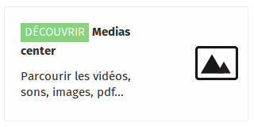
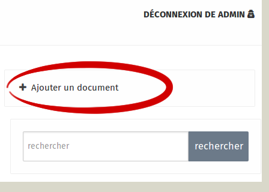
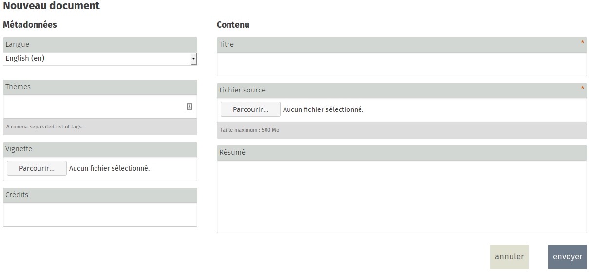
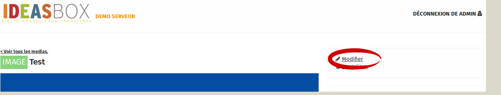
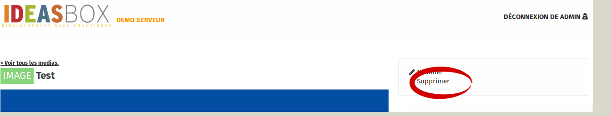

La rubrique média vous permet d'importer les médias suivants

L'import est réalisé manuellement fichier par fichier, aucun import en masse n'existe à ce jour. Vous devrez renseigner au moins pour chaque fichier  **2 champs obligatoires **
* Titre 
* Nom du fichier à importer

Les fichiers suivants sont acceptés : Image, Vidéo, Pdf, Son, Texte, Epub, Applications

**IMPORTANT**
Le **champ Thèmes** est optionnel mais permet de classer les médias par centre d'intérêt, cela peut être pratique pour constituer une collection de documents sur un sujet spécifique ! Utilisez le même mot clé pour chaque fichier envoyé afin de les regrouper dans cette thématique

## Ajout d'un document

Pour ajouter un nouveau média, rendez vous tout d'abord dans la rubrique **Médiacenter**.

Une fois connecté en tant qu'Administrateur, un nouveau menu apparaît sur l'écran de droite : **Ajouter un document**.

Une fois remplie, validez le formulaire afin d'envoyer votre document

**ATTENTION**
La taille du fichier a envoyer ne peut excédé 500Mo, le temps de transfert de votre fichier dans le media-center dépendra de son poids et de votre vitesse de connexion

## Ajout d'un document

### Les champs obligatoires

* Titre 
* Fichier source

### Les champs optionnels

* Langue
* Résumé
* Vignette \(si vous possédez une image illustrant le média\)
* Thémes \(Choisissez minutieusement les mots clés liés à votre article afin qu'il soit retrouvé facilement à l'aide de filtre\)
* crédits \(l'auteur du document\)

## Modification d'un document

Lorsque vous vous trouvez sur la page du média que vous souhaitez modifier, en haut à droite, cliquez sur le lien "Modifier" pour accéder au menu précédent afin de modifier le contenu ajouté 

## Suppression d'un document
Lorsque vous vous trouvez sur la page du média que vous souhaitez modifier, en haut à droite, cliquez sur le lien "Supprimer"

