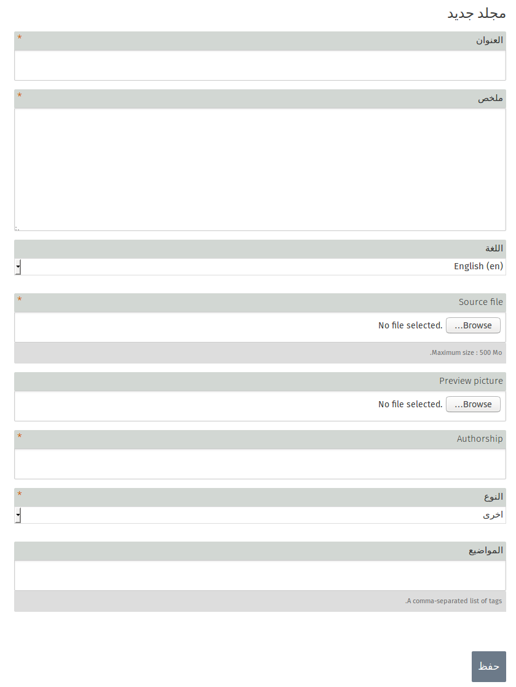

لتتمكن من أضافة ملف وسائط جديد يجب عليك أن تذهب الى تطبيق **مركز الوسائط المتعددة **.

في حال كان تسجيل الدخول كأحد المسؤولين , فأنه ستجد أيقونة جديدة على الجهة اليمنى من الشاشة:** أضافة مجلد ** .

تطبيق مركز الوسائط يستخدم لأستيراد مجموعه من الملفات و هي :
- الصور
- الفيديو 
- ملفات PDF
- الملفات الموسيقى ( الصوت )
- الملفات النصية 
- التطبيقات 
- ملفات Epubs

**الوسوم ** يمكنك أيضا أستخدامهافي تصنيف الملفات حسب الأهتمامات , كما يسهل عملية أنشاء ملفات حسب موضوع معين .

## أضافة ملف 

### الحقول الإجبارية 

- العنوان 
- الملخص
- Source File (الملف الذي تريد أضافته)
- Authorship (المؤلف)
- النوع (نوع الملف و من الممكن أن يكون :صورة , صوت , فيديو ...)

### الحقول الأختيارية 
- اللغة
- Preview Picture  (إذا أردت أضافه صورة تمثل الملف الذي تريد أضافته)
- المواضيع (يمكنك أضافتها لتساعدك في تصنيف الملفات و في عمليات البحث )

## التعديل على الملف 
حيث يمكنك التعديل على أسم أو خصائص الملف 

## حذف الملف 
لحذف الملف من مركز الوسائط المتعدده 
