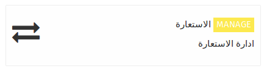
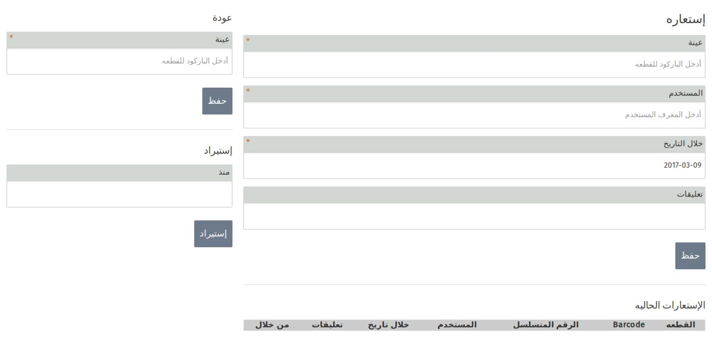
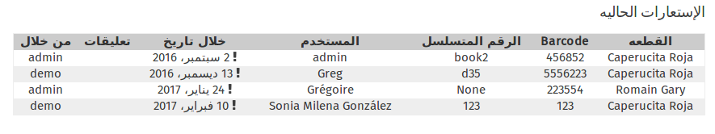
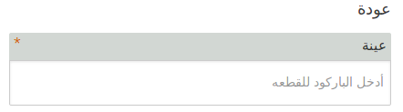
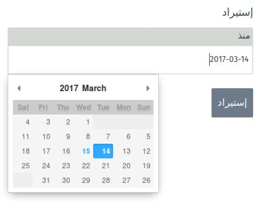

يمكنك أن تقوم على أعارة العناصر الموجوده في ال ideasbox بشرط أن يكون تم أضافتها الى تطبيق **المخزون** . 

بعد أن تتم أضافه جميع العناصر الموجوده في ال ideasbox الى تطبيق المخزون , يمكنك أعارتها الى المستخدمين بشرط أن يكون تم أضافتهم الى تطبيق **المستخدمين** .

##  أعارة الكتب , التابلت , الكمبيوتر 

من أجل اعاره المستخدم كتاب , تابلت أو كمبيوتر يجب عليك القيام ب:

- أدخل الباركود الخاص بالعنصر , عادة يكون الباركود المخصص لل ideasbox , يمكنك أدخاله يديويا أو باستعمال الماسح الضوئي المخصص لذلك .

-أدخل أسم المستخدم الذي تريد إعارته العنصر (يمكنك ألأعاره للمستخدمين المسجلين فقط ) .
- حدد التاريخ الذي تريد للمستخدم أعاده العنصر المستعار به .

ملاحظه : أي عنصر يملك باركود يمكنك أعارتها .

## عرض العناصر التي قيد الأعاره 

تحت الواجهة التي تستخدم لأعارة العناصر , يمكنك رؤيه قائمه العناصر التي قيد الاعارة و يعرض فيها :
 
- العنصر الذي تمت أعارته بالأضافه للباركود الخاص به 
- أسم المستخدم الذي تمت أعارته العنصر 
- تاريخ الأستعادة 
- أسم المسؤول الذي قام بعملية الأعارة

## عودة (المستردات)

عندما يقوم المستخدم بأرجاع العنصر الذي قام بأستعرته لأنهاء عمليه الأستعاره لا بد من أن تقوم على أدخال الباركود الخاص بالعنصر المسترد في الخانه المخصصه له من الجهة اليسرى من الشاشة .

## إستيراد لائحه الأعارة

**ملاحظة** : القائمه التي سوف يتم إستيرادها سوف تكون بصيغه SCV  و هي الصيغه التي يعمل بها ال ideascube .

للحصول على قائمه الأستعاره :

- قم بالضغط على خانه المخصصه للاستيراد 
- أختر التاريخ الذي تريد الحصول على قائمة الأستعاره الخاصة به .
- أضغط على زر **إستيراد**

