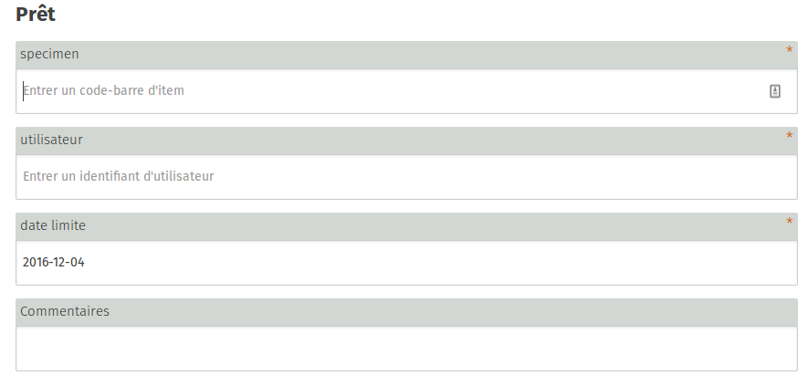
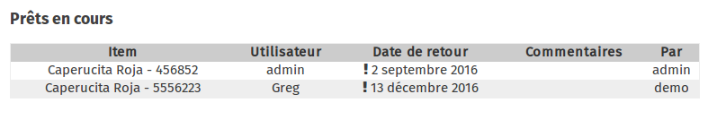
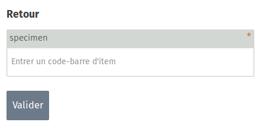
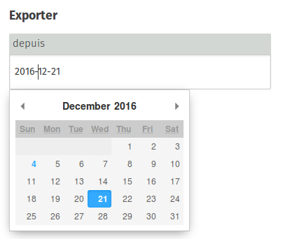

You can loan any item saved in the Ideas Box Stock application.

Once all of your devices are listed in the Ideascube Stock application, you can loan them to users listed in the "users" application.

## Loans for Books, E-Readers, Tablets, Computers, etc.

To loan an item to a user, such as a book, tablet, e-reader or computer:

- Enter the item’s barcode (usually there is a label with a barcode on Ideas Box devices) or scan the barcode using the USB scanner,
- Enter the name of the user to whom the item is to be loaned – you can only lend items to users who are already listed in the Ideas Box – to find the name of users, see their card or consult the "users" application in the Ideascube,
- Define the date on which the user must return the loaned item.

Any item fitted with a barcode may be loaned.

## Viewing items out on loan

Below the interface used to loan items, you can view the list of items currently out on loan with:

- The item on loan and its barcode
- The name of the person who has loaned the item
- The return date
- The name of the administrator who authorised the loan

## Returns

When library members return loaned books or e-readers, in order to end the loan in the Ideascube admin interface, simply enter the barcode of the returned item in the _Returns / specimen_ field.

## Exporting the list of loans

Please note: the list of all loaned items can be exported in CSV format:

- Click in the Exporter field,
- Enter the date from which you want the loan list, 
- Click on Export.
