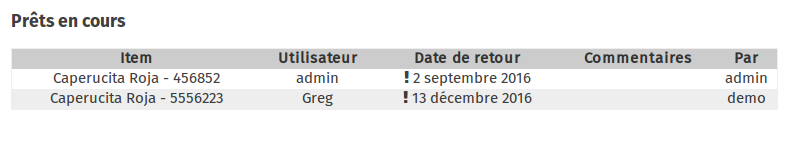

Il est possible de prêter tout item enregistré dans l'application Stock de l'ideas box.

Une fois tous vos équipements répertoriés dans [l'application Stock](../stock/) d'ideascube, vous pouvez les prêter aux utilisateur enregistrés dans l'application "utilisateurs". 

## Prêter un livre, une liseuse, une tablette, un ordinateur...

Pour prêter un objet  à un utilisateur, que ce soit un livre, une tablette, une liseuse ou un ordinateur : 
* entrer le code barre de l'objet (normalement une étiquette avec un code barre est collé sur les équipements de l'ideasbox) ou scannez le à l'aide de la douchette USB, 
* Entrez le nom de l'utilisateur à qui vous allez prêter l'objet - vous ne pouvez prêter d'objets qu'aux utilisateurs déjà enregistrés dans l'ideas box - pour retrouver le nom des utilisateurs, consultez leur carte ou allez dans l'application "utilisateurs" d'ideascube
* Définissez la date  à laquelle l'utilisateur doit rendre l'objet prêté

Tout objet muni d'un code barre peut être prêté.

## Voir les prêts en cours

En dessous de l'interface permettant de prêter des objets, apparaît la liste des prêts en cours avec :
* L'objet prêté et son code barre
* Le nom de la personne à qui il a été prêté
* La date de retour
* Le nom de l'administrateur qui a autorisé ce prêt

## Retours

Lorsque les membres des bibliothèques retournent les livres ou liseuse prêtés, afin de mettre fin au prêt dans l'interface de gestion d'ideascube, il suffit de rentrer le code barre de l'objet retourné dans le champs *Retours / specimen*.

## Exporter la liste des prêts

A noter : la liste de tous les objets prêtés peut être exportée sous forme de CSV :  
* cliquez dans le champs *Exporter*, 
* entrez la date à partir de laquelle vous voulez la liste de prêt, 
* Cliquez sur *Exporter*.
