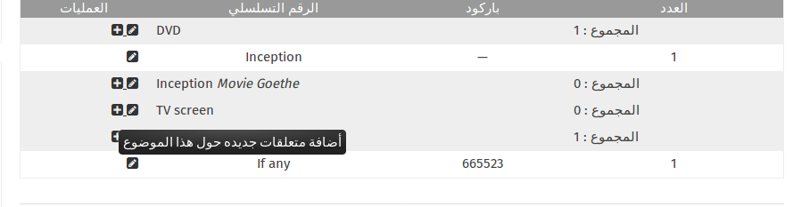

إن تطبيق **المخزون ** يسمح للمسؤولين بإداره عمليات الجرد لجميع العناصر الموجودة في ال (ideasbox) , إن أهميه الجرد تكمن في تتبع العناصر و معرفه في حال كانت هذه العناصر تحتاجالى صيانه , او هي قيد الأستعاره أو حتى اذا كانت هنالك حاجه لشراء عناصر جديده لأضافتها الى العناصر . 

إن المخزون مقسم الى خمس أقسام : قسم لكل صندوق من الصناديق بألاضافة الى قسم للعناصر الأخرى و هي العناصر الغير متواجده في الصناديق لكنها تتبع الى ال ideasbox

**ملاحظه**
عند قيامك بتنفيذ الجرد يفضل أن تقوم بتنفيذه بالتتالي تبعا للصناديق حيث ذلك أسهل للتنفيذ .

## 1. إنشاء المخزون 

عند أستخدام ال (ideasbox) للمرة الأولى لابد من القيام بعملية أضافه للمخزون بجميع العناصر الموجودة في الصناديق . أن هذه العملية يتم القيام بها مره واحدة فقط عند استلام الصناديق و قبل البدء بتنفيذ الأنشطة . 
بعد القيام بهذه العملية فأنه يجب على المسؤول الصناديق القيام بعمليه الجرد بشكل منتظم للتأكد من وجود جميع العناصر و حالتها أيضا .

 

### إنشاء المخزون : العناصر و العينات (القطع)

لأنشاء المخزون بالعناصر الموجوده في ال ideasbox  , يجب عليك أولا أضافه جميع العناصر (الصفات للعناصر ) ثم يمكنك أضافة القطع لهذه العناصر و تضاف القطع بعدد النسخ المتوافره منها .

#### العناصر
لأنشاء عنصر جديد بعد الضغط على تطبيق **المخزون** , يمكنك أضافه العناصر إما بالضغط على خيار **أضافه قطعه للجرد** المتواجده على الطرف الأيسر من الشاشة . حيث سوف تظهر لك شاشه أضافة موضوع جديد تمكنك من أضافه العناصر .

العنصر هو الوصف للقطعه ( الجهاز ) حيث في هذه الخطوة تقوم على أضافه المعلومات المتعلقة بالقطعه و هي :
- الصندوق الذي يحتوي على هذه القطعه ( الأداره , السينما , المكتبه , الوسائط المتعددة , الأخرى )
- الأسم المستعمل لهذا العنصر  بحيث يكون واضح و مفهوم من قبل الجميع مثل (TV-remote control )
- الوصف : و هو وصف مبسط لهذا العنصر (من الممكن عدم أضافه وصف )

### العينات ( القطع )

لكل عنصر من العناصر المضافه ( التلفاز , الاجهزة اللوحيه , الحواسيب و غيرها من العناصر يجب علينا أنشاء عينات (قطع ) بعدد القطع الموجوده لهذا العنصر في الصناديق .

 يمكنك **أضافه العينات (القطع) ** الخاصة بهذا العنصر من خلال أشاره الزائد(+) التي تظهر الى الجانب الايسر من أسم العنصر الذي قمت بأضافته. 
 

عند أختيارك لاضافة العينات (القطع) الى العنصر سوف تحصل على شاشه تتيح لك ذلك و بالتالي عليك أدخال مجموعه من المعلومات المتعلقه بهذه القطعه :

- رقم الباركود : و هو الرقم المخصص لideasbox 
- الرقم المتسلسل : و هو الرقم المتسلسل الموجود على الأجهزة الالكترونية 
- الكمية: بالشكل الأفتراضي فأن الرقم الكميه هو 1 لكن الكميه يمكن أن تختلف حسب نوع العينه (القطعه) التي ستقوم بأضافتها مثلا ( جهاز الحاسوب يبقى الرقم 1 , لكن لاقلام التلوين فأن العدد سوف يتغير الى عد الاقلام المتوفره لديكم )
-التعليقات : والتي تستخدم لاعطاء تعليق أو شرح مبسط عن حاله القطعه التي تقوم بأضافتها مثلا ( جهاز لوحي مكسور , لعبه ينقصها بعض القطع , لون القطعه و غيرها من التعليقات )

لتسهيل عمليه أضافه المخزون فأنه تم تزويدك بجهازين باركود لقراءه الارقام عن الجهاز بسهولا عوضا عن طباعتها , تحتاج فقط الى ربطها مه الحاسوب الشخصي بأستخدام كيبل USB .

### استثناء: الكتب

الكتب هي عبارة عن أصناف محددة تحمل خصائص محددة . إن تطبيق المخزون لا يحتوي على خيار أضافة مثل هذه الخصائص ( الناشر , المؤلف , السلسله و غيرها من الخصائص المتعلقة بالكتب ) 

لذلك ليس هنالك حاجة لأنشاء المخزون للمكتبه من تطبيق المخزون , حيث نقوم بأنشاء المكتبه من تطبيق المكتبه فقط .
عندما تقوم بأضافة الكتب الى تطبيق المكتبة , فإن جميع المعلومات سوف تظهر في قسم المكتبه داخل تطبيق المخزون .

حيث أن تطبيق المكتبة مرتبط بتطبيق المخزون 

## 2. إدارة المخزون (البدء بعملية الجرد )

بعد الأنتهاء من عملية أنشاء المخزون , يجب على المسؤول القيام بعملية الجرد بشكل دوري لجميع محتويات الصناديق .

للقيام بذلك من خلال ** تطبيق المخزون  ** يجب عليك إختيار أيقونة ** البدء بعملية الجرد ** على الجانب الأيسر من الشاشة . 

تظهر لك شاشة تتيح لك :
 
- التاريخ :  وهو التاريخ الخاص للقيام بعملية الجرد 
- تعليق : المعلومات التي ترغب بأضافتها لهذا الجرد ( العنوان , الهدف )
 

بعد ادخال المعلومات التي تريدها و الضغط على زر ** حفظ  ** سيتم تحوسلك الى شاشه الخاصه بالجرد حيث ستكون مشابهة لشاشه المخزون لكن الأختلاف سيكون انه الى جانب كل عنصر من عناصر المخزون هنالك اشاره صح داخل صندوق باللون الاحمر , و هذا دليل على أن هذه القطعه لم يتم التأكد من وجودها داخل الصندوق .

للقيام بالجرد عليك التأكد من وجود العناصر في الصناديق المخصصه لها , للقيام بذلك نقوم على أستخدام جهاز قرائه الباركودو القيام بالمسح الضوئي لكل باركود للعناصر مما سيتم تلقائيا ازاله المربع الأحمر من جانب أسم العنصر و تحويلها الى اللون اﻷبيض .

في حال واجهت مشكله فقد أحد العناصر من لائحه العناصر الوجوده , يتيح لك نظام الجرد من تعديل العدد المتوافر من العناصر من خلال العمليات الرياضية المتواجده على الطرف الأيسر من أسم كل عنصر .

في نهاية كل جرد يمكنك عرض العناصر التي تم أضافتها الى الصناديق , أو أزالتها من الصناديق , كما يمكنك أستيراد هذه القائمه الى حاسوبك الشخصي من خلال الخيارات الى الجانب الأيسر من شاشه تطبيق المخزون .لكنك ستحصل على هذه القائمه بصيغه ال CSV الخاصه بنظام ال ideascube .

