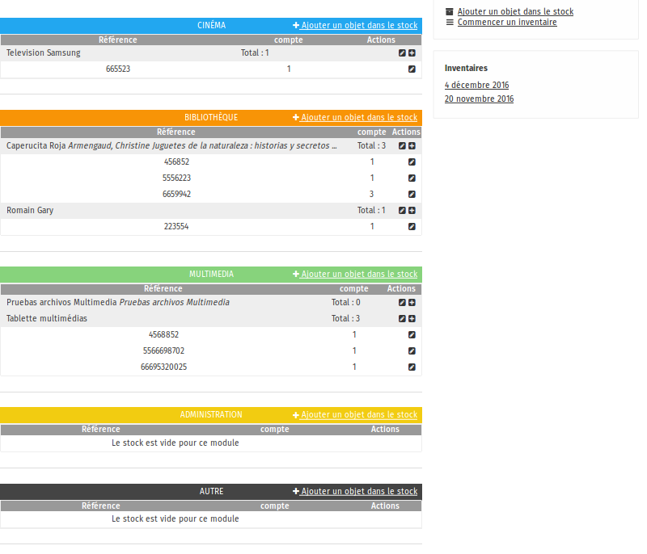
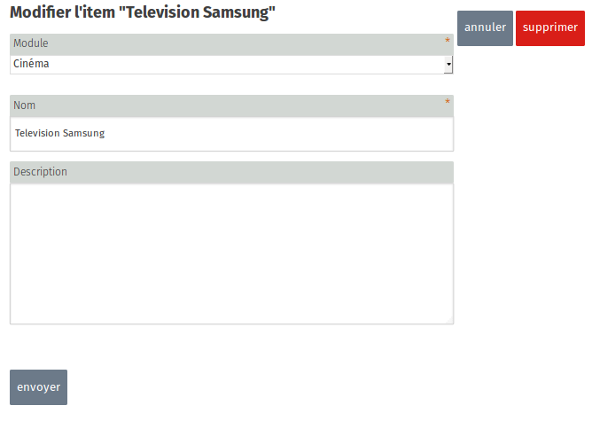
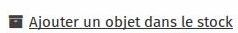
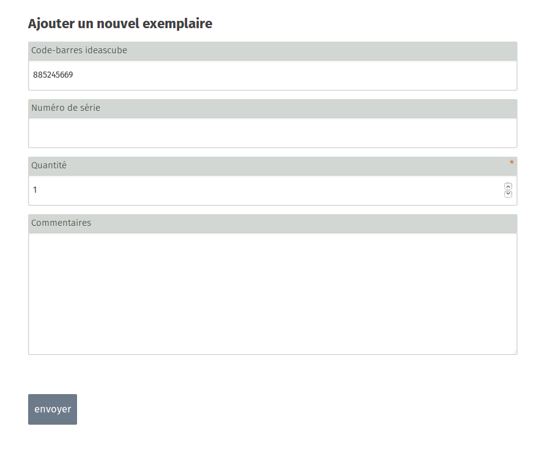
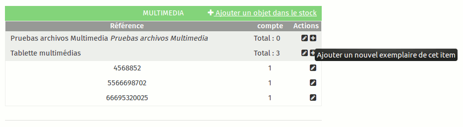
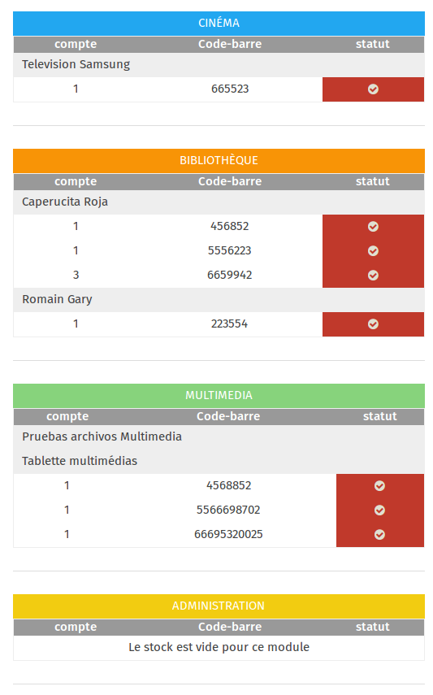
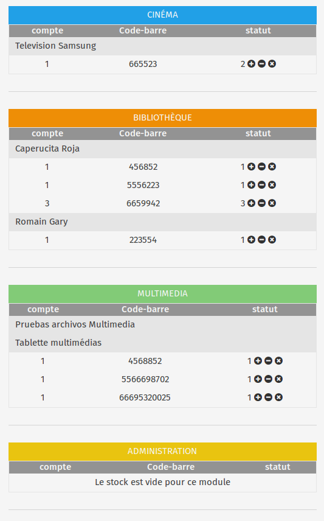

Administrators can manage the inventory of all items in the Ideas Box through the **Stock** application. Managing an inventory is essential to know the status of resources in an Ideas Box and to wee which supplies, books, computers or tablets are available, awaiting repair, on loan, or need to be to be repurchased.

Stock is organised into 5 sections: one per module and a "miscellaneous" section. When you conduct an inventory of your Ideas Box, it is easier to do so one module at a time.

## 1. Creating an Inventory

The first time that an Ideas Box is used, you must do an inventory of all items present in the Ideas Box. You only have to do this once, at the start of the Box’s use, but it is very important. Once the inventory is created, the Administrator of the Box must manage stock regularly and check the status of all items in the Ideas Box.

### Creating Stock: Items and Copies

To create an inventory of items in the Ideas Box, you must first of all create items (which correspond to a reference). Then, for each item, create copies of it. An item is related to one or more copies. For instance, it is possible to have more than one copy of a tablet. 

#### Items

An item is the description of the device you are going to list in the inventory. Related information:

- The module in which it is kept (Cinema, Administration, Library, Multimedia or Miscellaneous) 
- A clear name (example: Tablet 10” Android Samsung)
- A description

To add an item, click on **"add an item"**

#### Copies

For each type of item (television, tablet, computer, etc.), you must create as many copies as there are items of this type in the Box. A copy is given:

- A barcode: on the label stuck on tablets
- A serial number: for electronic devices
- A quantity: default setting is 1.  The quantity can change depending on your preferences: for example for a box of coloured pencils for which you wish to state the number of pencils in the box (or a puzzle for which you wish to state the number of pieces)
- Comments: which can be used to describe the condition of the item. E.g. tablet with damaged screen or incomplete board game. 

To add a copy of any given item, click on the "+" button next to the description of the item.

In order to speed up the creation of the initial inventory, Ideas Boxes come with hand-held scanners to be connected to the USB port of a computer to scan the barcodes on the labels of copies and to enter them automatically into the application when in the copy creation form. 

### Exception: Books

Books are specific items with specific features. The Stock application is unable to manage these features (example: publisher, cover, collection, etc.), and thus must be created directly in the [Library application](la_bibliotheque.html).

Once books are created in the Library, they will also appear in the Stock application and you will be able to conduct a full inventory of the Ideas Box.

## 2. Managing Stock: Inventories

Once the initial inventory is completed, the Administrator of the Ideas Box must conduct regular inventories of the Box. To do so, click on the **"Start an inventory"** button and a screen will open with all the listed items. For each copy of the item a box with a red tick means that for the moment the presence of the copy of the item in the Ideas Box has not yet been checked.

You must look at each item and scan it with the hand-held scanner. Once the barcode is scanned, the red tick becomes white.

This system allows you to easily see which items are missing from an inventory.

The list of all your inventories is archived in Ideascube. You are therefore able to view items which have been added since the last inventory and those which have been removed from the Ideas Box. You can also export inventories in csv format.