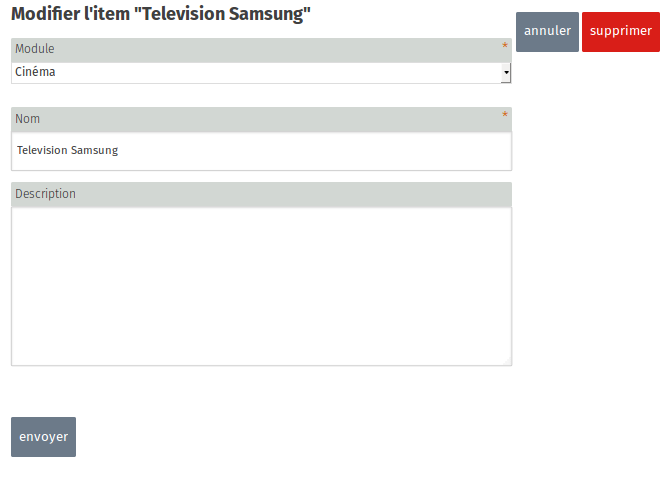
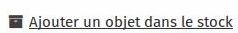
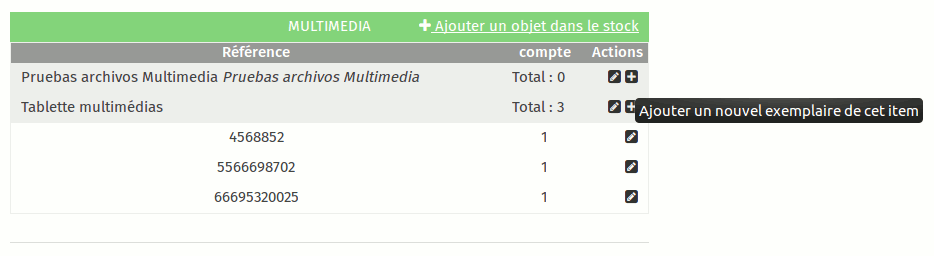
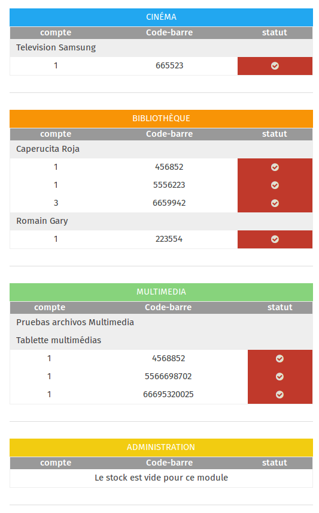

Les administrateurs ont la possibilité de gérer un inventaire de l'ensemble des objets présents dans l'ideas box grâce à l'application **stock**. Gérer un inventaire est indispensable pour connaître l'état des ressources d'une ideas box et avoir une visibilité sur les fournitures, livres, ordinateur ou tablettes présents, à réparer ou racheter ou en cours de prêt. 

Le stock est organisé en 5 sections : une par module et une section "autres". Ainsi lorsque vous ferez l'inventaire de votre ideas box, vous devrez le faire par module. Cela facilitera le processus.

## 1. Réaliser l'inventaire

La première fois que l'ideasbox est utilisée, il faut inventorier tous les objets présents dans l'ideasbox. Cette étape n'est  à effectuer qu'une seule fois,  au début de l'utilisation de la box, mais elle est indispensable. Une fois l'inventaire réalisé, l'administrateur de la box devra gérer le stock régulièrement et vérifier l'état de tous les objets de l'ideasbox. 

### Créer le stock : objets et exemplaires

Pour inventorier les équipements de l'ideas box, il faut d'abord créer des objets (ce qui correspond à une référence), puis pour chaque objet, créer des exemplaires de celui-ci. Un objet se voit associé un ou plusieurs exemplaires. Il est en effet tout à fait possible d'avoir plus d'un exemplaire d'une tablette. 

### Les objets

L'objet correspond à la description de l'équipement que vous allez inventorier. Il est caractérisé par :
* le module dans lequel il est rangé (Cinéma, Administration, Bibliothèque, Multimédia ou Autre)
* un nom clair (exemple : Tablette 10 pouces Android Samsung)
* Une description

Pour ajouter un objet, clique sur le libellé "ajouter un objet"

### Les exemplaires

Pour chaque type d'objet, télévision, tablette, ordinateur, etc. il faut créer autant d'exemplaires qu'il y a de ce type d'objet dans la box. Un exemplaire est lui caractérisé par : 
* Un code barre :  sur l'étiquette collée sur les tablettes
* un numéro de série : pour les équipements électroniques
* Une quantité : par défaut 1 ; la quantité peut changer s'il s'agit d'une boite de crayons de couleur et que l'on veut indiquer le nombre de crayons dans la boîte (ou un puzzle et que l'on veut indiquer le nombre de pièces)
* Des commentaires : qui peuvent servir  à décrire l'état de l'objet.Ex tablette avec écran abîmé ou jeux de société incomplet 

Pour ajouter un exemplaire d'objet donné, cliquer sur le bouton "+" à côté de la description de l'objet.

Afin d'accélérer la réalisation de l'inventaire initial, les Ideas Box sont équipées de douchettes à main qui permettent une fois branchées sur le port usb d'un ordinateur de scanner les codes barres sur les étiquettes des exemplaires et de les rentrer automatiquement dans l'application lorsqu'on est positionné sur le formulaire de saisie d'une exemplaire.

### L'exception : les livres
Les livres sont des objets particuliers qui ont des spécificités propres. L'application stock ne sait pas gérer ces particularités (exemple : éditeur, couverture, collection, etc.) Il ne faut aps les créer dans cette application mais directement dans [l'application Bibliothèque](la_bibliotheque.html).

Une fois les livres créés dans la bibliothèque, ils apparaîtront également dans l'application stock et vous aurez la possibilité de faire un inventaire complet de l'ideas box.

## 2. Gérer le stock : les inventaires

Une fois l'inventaire initial réalisé, le gestionnaire de l'ideas box devra réaliser régulièrement un inventaire de la box.  Pour ce faire, cliquer sur le bouton "Commencer un inventaire", un écran s'ouvre avec tous les objets référencés et pour chaque exemplaire de l'objet une case avec une coche rouge signifiant que pour l'instant, la présence de l'exemplaire de l'objet dans l'ideas box n'a pas été encore vérifiée.  

Il vous faut faire le tour de chaque objet, et le scanner avec la douchette. Une fois le code barre scanné,  la case rouge redevient blanche.

Ce système vous permet devoir très simplement quels objets sont manquants d'un inventaire à l'autre.

La liste de tous vos inventaires est conservé dans ideascube. Vous avez ainsi la possibilité de voir d'un inventaire sur l'autre les objets qui ont été ajoutés et ceux qui ont été supprimés de l'ideas box. Vous avez également la possibilité d'exporter les inventaire au format csv.

