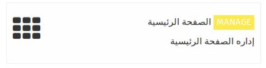
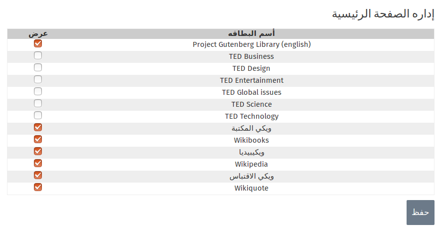

إن تطبيق **اداره الصفحه الرئيسية** يتيح لك التحكم بالتطبيقات التي تري أظهارها للمستخدم على الصفحه الرئيسيه للواجهة التابعه للمستخدم .
 
المسؤول يمكنه تحديد التطبيقات التي يريد المستخدمين تصفحها , و ذلك حسب حاجات المستخدمين أو الوضع الذي يواجهه المسؤول مع المستخدمين  ( بإختصار : إن هذا الموضوع يتبع لما يراه المسؤول مناسبا لعرضه للمستخدمين أو عدم عرضه ) 
و في حال أختياره لعدم عرض التطبيق فهذا لن يؤثر على التطبيق , إذ حيث سيبقى التطبيق موجودا لكن لن يتمكن المستخدمين من رؤيته و تصفحه .
لأختيار عدم أظهار أحد التطبيقات قم بألغاء أشاره الصح الى جانب أسم التطبيق ثم أضغط على حفظ , و بذلك سوف يتم عدم أظهار هذا التطبيق على الصفحه الرئيسيه للمستخدمين .

 
