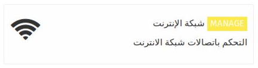

 

يمكنك الاتصال بشبكة الواي فاي المتاحة في حال لم يكن هنالك كيبل أنترنت أرضي .

**هذه الخاصية تمكنك من **

- تحديث ال ideascube  (حيث يتم تحديث النظام تلقائيا عند الاتصال بالانترنت )
-يكون بمثابة جسر مع شبكة الإنترنت في حين تبقى متصلا بالانترنت و يمكنك  والوصول إلى التطبيقات الخاصة بك في داخل ال ideasbox

## ألأتصال بشبكة الانترنت - الواي فاي 

عند الضغط على ايقونه** شبكةالأنترنت ** سوف تحصل على لائحه بأسماء شبكات الواي فاي المتاح الاتصال بها , في حال كانت هذه الشبكه تملك شعار قفل أسود صغير فهذا دليل على أن هذه الشبكه محمية و تحتاج الى كلمه مرور للأتصال بها . 

عند توثيق الأتصال مع شبكه الواي فاي فإن هذه الشبكه سوف تبقى محفوظه للمستقبل , فعند تواجد الخادم في محيط الشبكه النترنت سوف يتم الأتصال بشكل تلقائي دون الحاجة ﻷعاده أدخال كلمه المرور .

في حال أردت حذف هذه الشبكه فيمكنك ذلك من خلال خيار التاريخ .