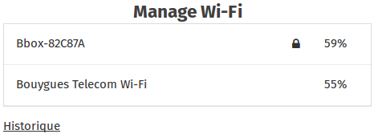

  

The KoomBook can connect to an existing WiFi network if you do not have an Ethernet cable.

**This function enables you to:**

- Update the KoomBook (which automatically uploads updates when connected to the Internet)
- Act as a bridge with the Internet while remaining connected to the KoomBook and accessing your applications within it.

## Connecting to a WiFi network

  

Click on the WiFi network you wish to connect to. If this network is private (you will see a little black padlock), a password is required.

Once a hotspot is configured, it is stored in the memory for future use. No passwords will be requested when connecting. To delete the network, click on History.
