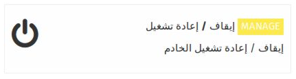
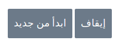

عند تسجيل دخولك كأحد المسؤوليين فإن أيقونة ** إيقاف / إعادة التشغيل ** سوف تظهر مما يمكنك من إيقاف تشغيل الخادم  هذه هي الطريقه الوحيدة التي يمكنك إيقاف تشغيل الخادم بها ideasbox

عند الضغط على هذه الأيقونه سوف تحصل على شاشه تحتوي على خيارين :

قم بإختيار الخيار الذي تريد تنفيذه بالضغط عليه فقط 

في حال حصولك على تحذير بأن الخادم قيد العمل , ننصحك بعدم **إجبار إيقاف التشغيل** , حيث من الممكن أن يسبب عطل في نظام تشغيل الخادم .
للتأكد من أن الخادم تم أيقاف تشغيله , بالنظر الى ضوء التشغيل الأخضر سوف يكون تم إيقاف تفعيله 
