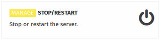
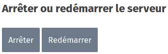

The **STOP/RESTART** function appears when you are connected as an Administrator. This is the only way to turn off the device. 

Click on one of the two buttons to make your choice.

>>>>We recommend that you **do not force shutdown** via the push button. If you do so, you may cause permanent damage to the device’s operating system.

The KoomBook is completely shut down after the blue LED goes off.