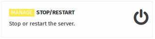
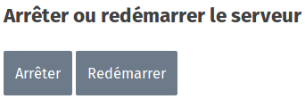

>>>>> Pour l'Ideascube matériel référez vous à la procédure [Arrêt / Démarrage](http://ideascube-hardware.doc.bibliosansfrontieres.org/en/start_stop) de la documentation de l'[Ideascube matériel](http://ideascube-hardware.doc.bibliosansfrontieres.org) 

**La rubrique « Arrêter/redémarrer »** apparaît lorsque vous êtes connecté en tant qu'Administrateur. C'est le seul et unique endroit pour arrêter l'appareil.

Cliquez sur l'un des deux boutons suivant votre choix

**Il n'est pas recommandé** d'éteindre brutalement l'appareil avec le bouton poussoir, vous pourriez endomager de manière irrémédiable le système d'exploitation de ce dernier.

Le KoomBook est complètement arrêté après que la LED bleu se soit éteinte.

