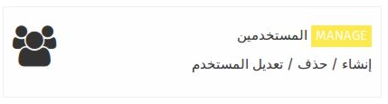
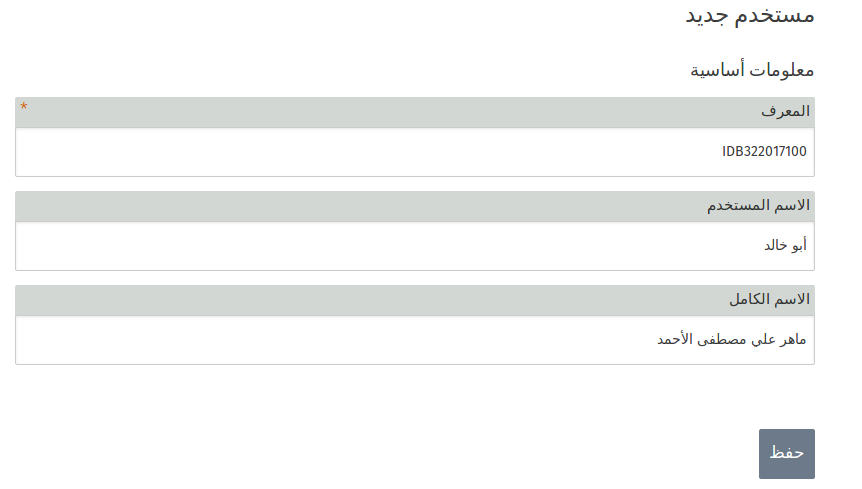
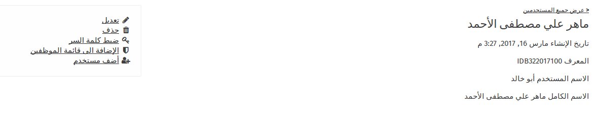
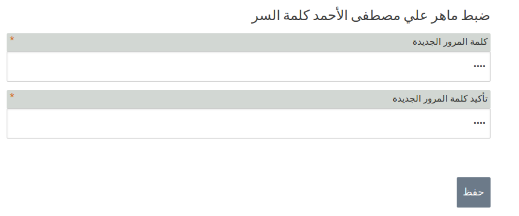

 

 في هذا التطبيق يمكنك من إنشاء ,تعديل , او حذف المستخدم . و يمكنك من أعطاء المستخدمين خاصيه ** الأضافة الى قائمة الموظفين   ** و تخصيص كلمه مرور خاصه به مما يعطيه الصلاحيات الخاصه بالمسؤولين .

## إضافه مستخدم جديد 

عند دخولك الى تطبيق **المستخدمين ** يمكنك أضافة مستخدم جديد من الخيار المتواجد على الطرف الأيسر من الشاشة ** إضافة مستخدم ** .

عند اختيارلك له تظهر لك شاشة لأدخال المعلومات الخاصه بالمستخدم الجديد و هي :

-المعرف : و هو الرقم الخاص ببطاقة العضويه الخاصه للمستخدم 
-الأسم المستخدم : و هو الأسم الذي يستعمله المستخدم في حياته اليوميه , من الممكن أن يكون نفس الأسم أو من الممكن أن يكون لقب مثل ( ابو خالد ) و غيرها من الألقاب 
-الأسم الكامل : و هو الأسم الرباعي المقاطع للمستخدم 

ملاحظة: إن هذه البيانات من الممكن أن تختلف من خادم الى أخر حيث يمكن تعديل المعلومات المطلوبه من المستخدم بأضافه خانات جديده حسب الحاجه المسؤولين .

بعد قيامك بإنشاء المستخدم الجديد و الضغط على زر الحفظ سوف تنتقل تلقائيا الى شاشه تعرض لك بيانات المستخدم الذي قمت بإضافته بالأضافة الى مجموعة من الخيارات الى الجانب الأيسر من الشاشه  التي يمكنك إجرائها لهذا المستخدم و منها :

- تعديل : و هي التعديل على بيانات المستخدم
- حذف : و هي حذف المستخدم نهائيا من النظام 
- ضبط كلمة السر : حيث يمكنك إعطاء كلمة سر لهذا المستخدم 
- الإضافة الى قائمه الموظفين : هذا الخيار يتيح لك تحويل هذا المستخدم من مستخدم الى مسؤول 

## إعطاء المستخدم صلاحيه المسؤول

عند أضافتك للمستخدم , فإنه يكون من دون أي صلاحيات , لكن بأمكانك أعطائه صلاحيات المسؤول التي تخوله على سبيل المثال الى أضافه مستخدمين جدد , أضافه محتويات الى مركز الوسائط و غيرها من الصلاحيات .
للقيام بذلك عليك القيام بعدة خطوات :

### الخطوة الأولى 

**ضبط كلمه السر** 
بعد أختيارك للمستخدم الذي تريد أعطائه الصلاحيات بالضغط على أسمه من قائمه أسماء المستخدمين سيتم تحويلك الى لشاشه التي تحوي** خيار ضبط كلمة السر ** , عندها يمكنك تعيين كلمه سر لهذا المستخدم .

### الخطوة الثانية 

بعد أتمام عملية تعيين كلمه السر للمستخدم , نقوم على أضافة خاصيه ** الأضافة الى قائمه الموظفين ** و بهذه الخطوة يكون قد تم أضافة المستخدم الى قائمه المستخدمين .

ملاحظة : لمعرفه المستخدمين الذين تم تعيينهم كمسؤولين يمكنك ملاحظه وجود رمز شعار الحمايه الى الجانب الأيمن من أسم المستخدم .

## تغيير كلمة السر للمستخدم 

### الخطوة الأولى

من قائمه المستخدمين قم بأختيار أسم المستخدم المسؤول الذي تريد تغيير كلمه المرور الخاصة به .

### الخطوة الثانية 

من الجانب الأيمن للشاشة نقوم بإختيار خيار ** ضبط كلمه السر ** 
مما يتيح لك تغيير كلمه السر الخاصة بالمستخدم بكلمه سر جديدة .

### الخطوة الثالثة 

في الشاشه التي سوف تظهر لك قم بأدخال كلمة السر الجديدة في كلا الصندوقين , ثم أضغط على زر حفظ .

و بهذا تكون قد قمت بتعيين كلمة مرور جديده للمستخدم .

** ملاحظة : **
لإنشاء كلمة مرور قوية، يجب أن ننسى كلمات السر العشوائية والبحث عن عبارات (جملة ) مرور. على سبيل المثال: "القارب يطفو على نهر" هو عبارة مرور جيدا و من السهل أن نتذكرها.

## تعديل معلومات المستخدم 

### الخطوة الأولى

من قائمه المستخدمين قم بأختيار أسم المستخدم الذي تريد تعديل المعلومات الخاصة به .

### الخطوة الثانية 

من الجانب الأيمن للشاشة نقوم بإختيار خيار ** تعديل ** 
مما يتيح لك تعديل المعلومات الخاصة بالمستخدم .

### الخطوة الثالثة 

في الشاشه التي سوف تظهر لك قم بالتعديل وفقا للمعلومات التي تريد تعديلها  , ثم أضغط على زر حفظ .

## حذف المستخدم

### الخطوة الأولى 

من قائمه المستخدمين قم بأختيار أسم المستخدم الذي تريد حذفة من قائمه المستخدمين .

### الخطوة الثانية

من الجانب الأيمن للشاشة نقوم بإختيار خيار ** حذف ** 
مما يتيح لك حذف المعلومات الخاصة بالمستخدم .

### الخطوة الثالثة 

عند الضغط على خيار الحذف سوف يتم تحويلك الى شاشة تظهر لك رساله تأكيد لحذف هذا المستخدم .
اذا اردت الحذف أضغط على زر ** نعم **

و بهذه الطريقه تكون قد حذفت المستخدم من لائحه المستخدمين , و لا يمكنك أسترجاع معلوماته في حال تم الحذف .
