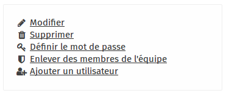
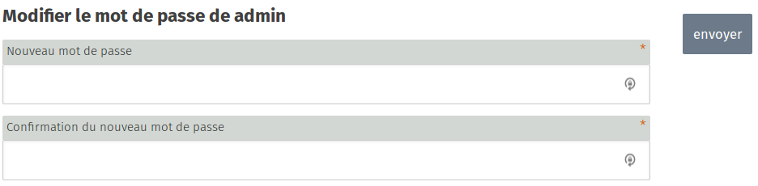

### Step 1

In the main window of the user admin section, click on the user for whom you wish to change the password. 

Here, for example, we are going to change the password of the **admin** account. Click on the **admin** link.

### Step 2
In the right-hand menu, click on **"Set password"**

### Step 3

In this new window, enter the new password in each box. When finished, click on the **Submit** button.

>>>>>>To create a strong password, forget passwords and look for passphrases instead. For example: "The boat floats on the river" is a good passphrase that is easy to remember. Now, select your own passphrase!
