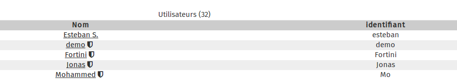
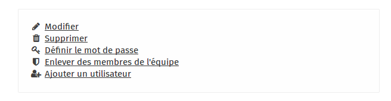
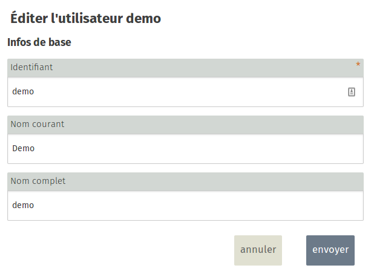

### Step 1
  

In the main window of the user admin section, click on the user you wish to edit. 

Here, for example, we are going to edit the **admin** account. Click on the **admin** link.

### Step 2

In the right-hand menu, click on **Modify**

### Step 3

In this new window, you can modify information. Click on **Submit** to save your changes.
 

