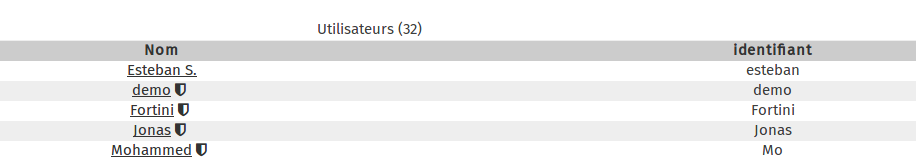
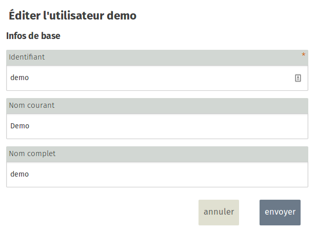

## Etape 1

Dans la fenêtre principal de la gestion des utilisateurs, cliquez sur l'utilisateur pour lequel vous souhaitez changer le mot de passe.   
Ici par exemple nous allons changer le mot de passe du compte **demo**. Cliquez donc sur le lien **demo**

## Etape 2
Sur le menu de droite, cliquez sur **Modifier**  

## Etape 3
A partir de cette nouvelle fenêtre vous pouvez modifier les informations que vous souhaitez, cliquez sur **Valider** pour enregistrer les informations  

