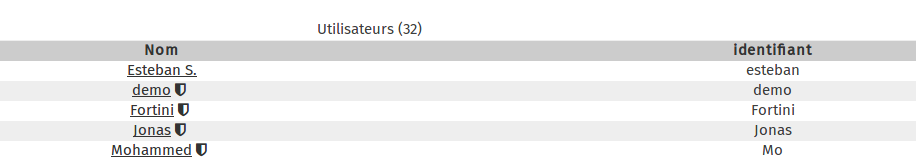
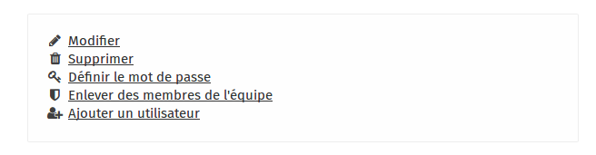

### Step 1
  

In the main window of the user admin section, click on the user you wish to remove. 

Here, for example, we are going to delete the **demo** account. Click on the **demo** link.

### Step 2

In the right-hand menu, click on **Remove**

### Step 3

Confirm the deletion of the user by clicking on **Yes**