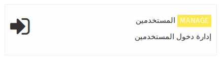
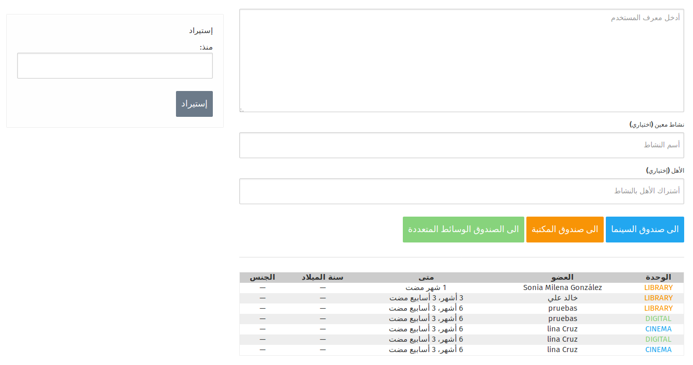
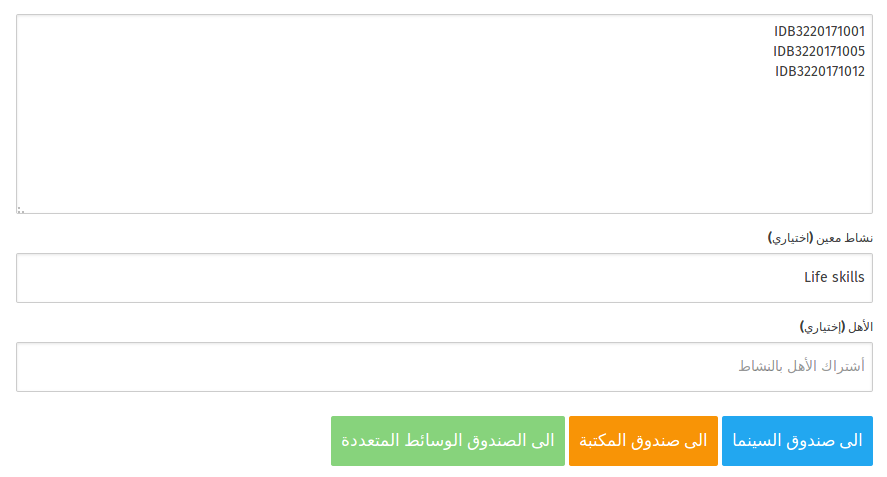
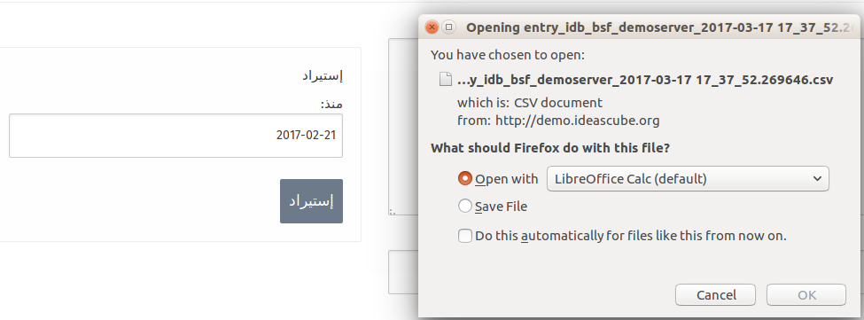

في هذا التطبيق يمكنك من إدارة دخول المستخدمين , حيث من خلال هذا التطبيق ستقوم بأختيار الصندوق الذي تم أستخدامه لتنفيذ النشاط من قبل المستخدمين .

             

عند إختيار تطبيق إداره المستخدمين سيتم تحويلك الى الصفحه التي ستقوم من خلالها بإداره دخول المستخدمين تبعا للصندوق الذي تم أستخدامه , كما يمكنك من رؤيه لائحه المستخدمين الذين تم أداره دخولهم من خلال اللائحه الظاهره في أسفل الشاشه , و يمكنك أيضا استيراد قائمه المستخدمين الذين تم أداره دخولهم . 

## تسجيل دخول المستخدمين 
من خلال صفحه أداره دخول المستخدمين تقوم على أداره تسجيل دخولهم من خلال تنفيذك لمجموعه من الخطوات المتتاليه و هي : 

### الخطوة الأولى 

** أدخل معرف المستخدم **
في هذه الخطوة تقم على أدخال معرف المستخدم , و هو الرقم المتواجد على بطاقه العضوية التابعه له , كما يمكنك من أدخال أكثر من مستخدم في نفس الوقت بشرط ان يكون كل أدخال على سطر منفصل عن الأدخال الذي قبله 
** ملاحظة ** يمكنك أدخال المعرف يدويا , أو بأستخدام جهاز قارئ الباركود لتسهيل و تسريع العملية .

### الخطوة الثانية 

في هذه الخطوة تقوم على أختيار أسم النشاط الذي سيقوم المستخدمين بتنفيذه من خانه ** نشاط معين ** , حيث هذه الخطوة هي خطوة أختياريه إذ يمكنك تسجيل دخولهم دون تحديد النشاط الذي سيقومون بتنفيذه 

#### الخطوة الثالثة 

في هذه الخطوة تقوم على أدخال المعرف الخاص بالأهل في حال تم تنفيذ النشاط مع الأهل في خانه  ** الأهل  ** , حيث هذه الخطوة هي خطوة أختياريه إذ يمكنك تسجيل دخولهم دون أضافه الأهل 

#### الخطوة الرابعه 

أن هذه الخطوة يمكن أعتبارها بانها الخطوة التي تقوم على حفظ الأدخال الذي ستقوم به حيث عند الضغط على أحد الخيارات الثلاثه المتواجده سيتم حفظ هذا الأدخال و سيظهر في قائمه الادخال أسفل الشاشه .

**الخيارات المتاحه**

- الى صندوق السينما : يتم أختيارها في حال تم أستخدام صندوق السينما في تنفيذ النشاط 
- الى صندوق المكتبة :يتم أختيارها في حال تم أستخدام صندوق المكتبة في تنفيذ النشاط
- الى صندوق الوسائط المتعددة :يتم أختيارها في حال تم أستخدام صندوق الوسائط المتعددة في تنفيذ النشاط

                 
   
   
  ## إستيراد قائمه أداره المستخدمين 
  
 يتيح لك هذا الخيار الحصول على قائمه المستخدمين الذين تم أدارة دخولهم الى الصناديق من خلال خيار ** الاستيراد ** المتواجد على الجانب الأيسر من الشاشة , حيث عليك فقط أختيار التاريخ الذي ترود الحصول على القائمه المستخدمين به و الضغط على ** أستيراد** و بالتالي ستحصل على القائمه محفوظه على جهازك الحاسوب الشخصي ,لكنك ستحصل على هذه القائمه بصيغه ال CSV الخاصه بنظام ال ideascube .

 