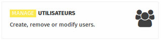

 
 
This section is used to create, modify or remove users. Each user with “staff” status is granted blog and media admin rights.  Use this section to find out how to add, edit and remove a user, as well as manage their status or change their password.
