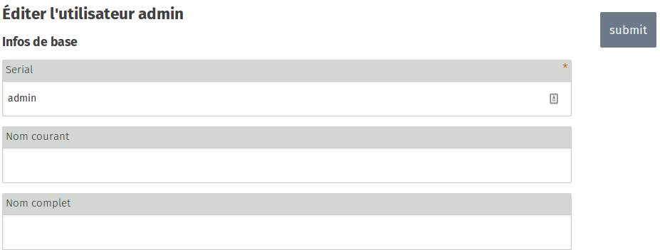
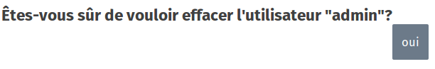

 
 
This section is used to create, modify or remove users. Each user with “staff” status is granted blog and media admin rights.  Use this section to find out how to add, edit and remove a user, as well as manage their status or change their password.

## Modifying a User
### Step 1
  

In the main window of the user admin section, click on the user you wish to modify. 

Here, for example, we are going to modify the **admin** account. Click on the **admin** link.

### Step 2

In the right-hand menu, click on **Modify**)

### Step 3

In this new window, you can modify information. Click on **Submit** to save your changes.
 

## Removing a User
### Step 1
  

In the main window of the user admin section, click on the user for whom you wish to remove. 

Here, for example, we are going to remove the **admin** account. Click on the **admin** link.

### Step 2

In the right-hand menu, click on **Remove**

### Step 3

Confirm the deletion of the user by clicking on **Yes**

