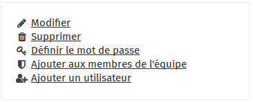

# Users
 
 
This section is used to create, modify or remove users. Each user with “staff” status is granted blog and media admin rights.

## Adding a new user

Click in the right-hand menu on **Add a user** then enter:

- **Serial**: the user’s username
- **Full name**: the user’s full name

In the right-hand menu, click on **Set password** to add a password to the user you have just created. In the right-hand menu, click on **Add staff status** to add administrator rights.

## Adding administrator rights to a user

If you have created a standard user (with no specific rights), you may want to grant new rights so that the user can, for example, add content to the Media Center.

### Step 1

In the main window of the user admin section, click on the user for whom you wish to change the password. 

Here, for example, we are going to change the password of the **admin** account. Click on the **admin** link.

### Step 2

In the right-hand menu, click on **Add to team members**

  

Your user now enjoys administrator rights.

## Changing a user’s password
### Step 1

In the main window of the user admin section, click on the user for whom you wish to change the password. 

Here, for example, we are going to change the password of the **admin** account. Click on the **admin** link.

### Step 2
In the right-hand menu, click on **"Set password"**

### Step 3

In this new window, enter the new password in each box. When finished, click on the **Submit** button.

**/!\ PLEASE NOTE**: To create a strong password, forget passwords and look for passphrases. For example: "The boat floats on the river" is a good passphrase that is easy to remember. Now, select your own passphrase!

## Modifying a user
### Step 1
  

In the main window of the user admin section, click on the user for whom you wish to change the password. 

Here, for example, we are going to change the password of the **admin** account. Click on the **admin** link.

### Step 2

In the right-hand menu, click on **Modify**)

### Step 3

In this new window, you can modify information. Click on **Submit** to save your changes.
 

## Removing a user
### Step 1
  

In the main window of the user admin section, click on the user for whom you wish to change the password. 

Here, for example, we are going to change the password of the **admin** account. Click on the **admin** link.

### Step 2

In the right-hand menu, click on **Remove**

### Step 3

Confirm the deletion of the user by clicking on Yes

