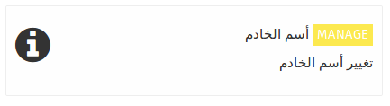
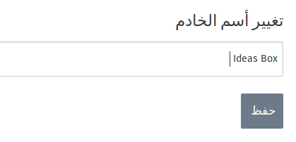

عند تسجيل دخولك كأحد المسؤولين يمكنك القيام بتغير أسم الخادم بما تجده مناسبا و يكون ذا دلاله واضحه على موقعه أو الطريقه التي يستخدم بها . 

الأسم الأفتراضي للخادم هو Ideas Cube , حيث يعتبر دلاله على نظام التشغيل الذي يعمل عليه الخادم 

لتغير أسم الخادم تقوم بالضغط على تطبيق ** أسم الخادم ** مما ينقلك الى الصفحه التي تستطيع تغير أسم الخادم من خلالها و ذلك من خلال كتابه أسم الخادم الذي تريد في الخانه المخصصه له من ثم الضغط على زر ** حفظ **

