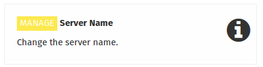
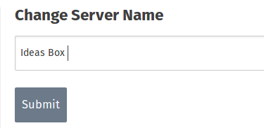

When you are logged on as an administrator, you can change the name of the server to have a clear indication of its location or the way it is used.

The default name for the server is Ideas Cube, which is an indication of the operating system on which the server is running

To change the name of the server click on the application **server name**, which takes you to the page where you can change the name of the server.  Write the new name of the server in the box and then press **submit**.

