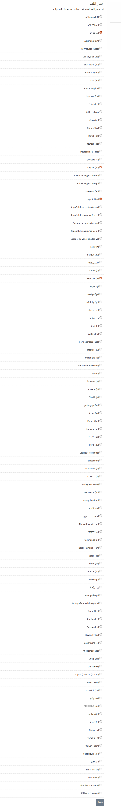

عند تسجيل دخولك كأحد المسؤولين , و بعد أختيارك لتطبيق الأعدادات يمكنك القيام بإختيار اللغات التي يستطيع المسؤولين أدخال الوسائط بها( هي اللغات التي تصبح متاحه في قائمه اللغات عند أدخال الوسائط ).
 
 لتعديل اللغات المتاحه تقوم بالضغط على تطبيق ** اللغات ** مما ينقلك الى الصفحه التي تستطيع من خلالها تحدديد اللغات التي تريدها أن تصبح متاحه , من خلال أختيار الصندوق الصغير الذي يقع على جانب كل لغه , ثم تقوم بالضغط على زر ** حفظ  ** 
 

