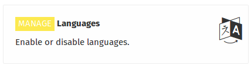
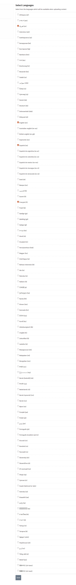

When you are logged in as an administrator, you can select the languages in which administrators can enter the content with (languages that are available in the Language menu when adding content to the server ).

To edit the languages available, click on ** Languages **,which will take you to the page where you can select the languages you want to be available, by selecting the small box that is on the side of each language, then clicking the ** Save ** button.

