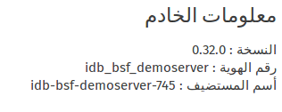
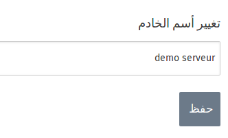

من خلال هذا الخيار يمكنك رؤيه المعلومات التي تتعلق بالخادم و هي : 

* النسخه : و هي النسخه المستخدمه من نظام التشغيل ideascube

* رقم الهوية : و هو الأسم المعرف المخصص لهذا الخادم 
* إسم المستضيف : و هو الأسم المخصص لهذا الخادم و هو الأسم المستخدم للشبكه المحليه للخادم 

و كما ترى بالصورة المرفقة فأن هذه المعلومات لا يمكنك التعديل عليها .

* إسم الخادم 

من خلال هذاالخيار يمكنك تغير أسم الخادم بالأسم الذي تجده مناسبا
و بالضغط على زر الحفظ سوف يحفظ أسم الخادم الذي أخترته و ستجده ظهر في الطرف الأيمن على الشاشه بجانب أسم شعار ال IDEAS BOX

