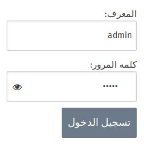
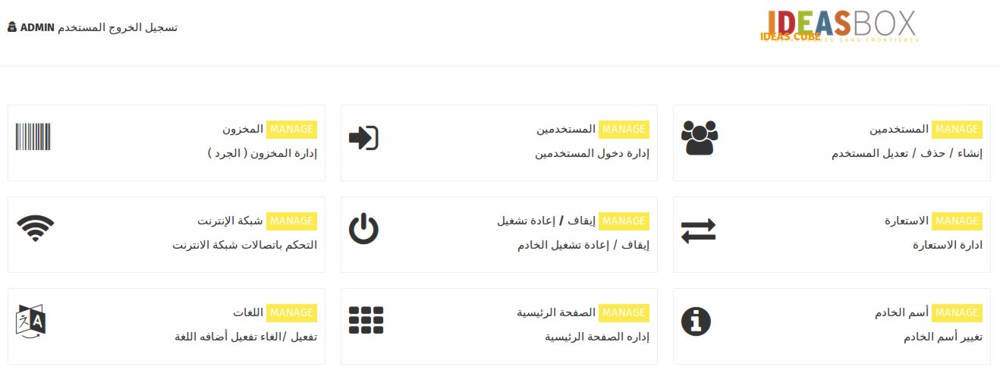

من أجل الوصول الى وظائف إداراه ال ideas box , يجب عليك الدخول الى واجهة المستخدم 

## تسجيل الدخول الى صفحات الأدارة :

على الجانب الأعلى الأيمن لواجهة المستخدم أضغط على **" تسجيل الدخول "**

**و عندها سيتم توجيهك الى صفحه تسجيل الدخول :**

أدخل أسم المستخدم و كلمه المرور المختارة عند تسجيل الدخول ﻷول مرة .

بعد الدخول الى صفحه الأداره يمكنك القيام ببضع الوظائف التي لا يستطيع المستخدم تنفيذها و هي :

## المهام المتاحه :

**1- المستخدمين : حيث يمكنك إنشاء / حذف/ تعديل على المستخدمين** 

**2- إدارة دخول المستخدمين **

**3- إدارة المخزون \( الجرد \)**

**4- الأستعارة : تتيح لك تتبع المحتويات التي تمت إعارتها للمستخدمين **

**5- شبكة الأنترنت : تتيح لك ربط الخادم بشبكه الأنترنت **

**6- أسم الخادم : تتيح لك تغير أسم الخادم بالأسم المناسب **

**7- اللغات : تتيح لك إختيار اللغة التي ترغب بأضافتها عند تحميل المحتويات**

**8- الصفحة الرئيسية : تتيح لك إدارة التطبيقات التي تريد أظهارها في الصفحة الرئيسية للمستخدمين .**

**9- ايقاف و إعادة تشغيل الخادم \( و هي الطريقه الوحيده لأيقاف ال ideasbox \)**

**بالأضافة الى** **إنشاء/تعديل/حذف على كل من محتوى ال مدونة و ملفات الوسائط **

